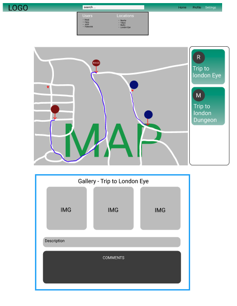
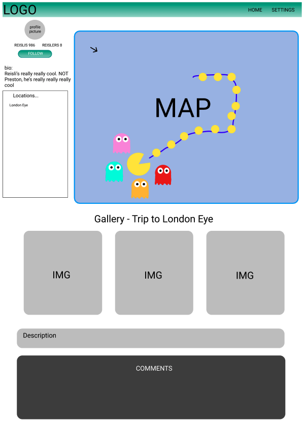
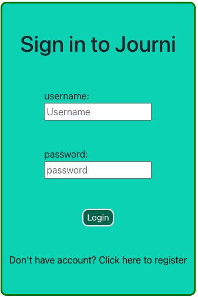
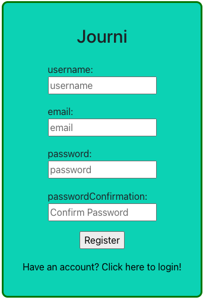
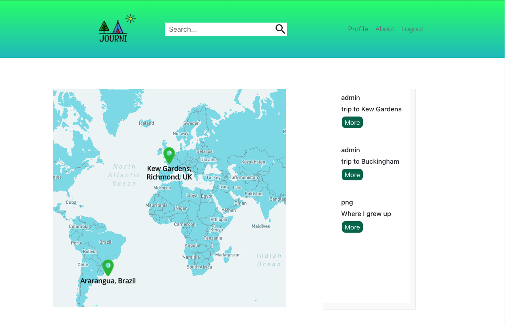
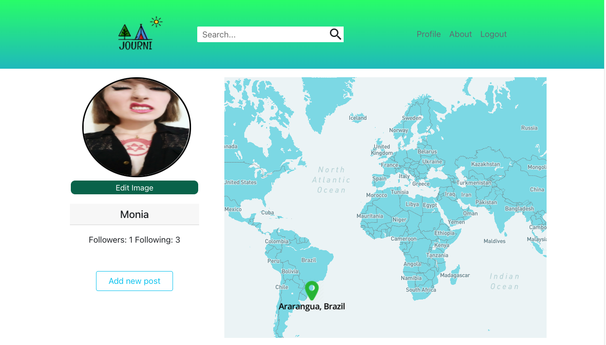

# Journi

## Project Overview

This was the third project I did during my Software Engineering Immersive course. The project ‘Journi’ is a social media site that allows its users to share posts about trips they made around the world. Users can view the locations of these posts on a map, follow other users, and comment on others’ posts.

## Deployment:

## How to download:

The projects’ files can be accessed here.

If you want to clone the repository:
Click the button labeled ‘Code’.
On the dropdown menu select HTTPS and copy the link provided.
Using the terminal, navigate to where you want to clone the repository and execute the command: “git clone (copied HTTPS link)”
If you want to download the ZIP file:
Click the button labeled ‘Code’
Click the ‘Download ZIP’ button on the dropdown menu.

##Goal and Timeframe:

The objective of this project was to create a web-app with full CRUD functionality using a MongoDB backend and a React frontend. The timeframe was 10 days.

## Technology Used:

- HTML5
- CSS
- JavaScript
- MongoDB
- Mongoose
- Express
- JWT
- Bcrypt
- Axios
- React
- Git
- Mapbox API

## App Flow:

Journi is a web app that allows users to upload posts about places that they have been to anywhere in the world. Users can then see the posts of the people they follow on a map and comment on those posts.

## Functionality:

On Journi, users are able to:
    - Register an account and login.
    - Visit other users’ pages, follow them, and view their posts.
    - View the posts of all their followees on the homepage and go to the location of their posts on the map.
    - Expand any selected post to see extra information.
    - Comment on any post.
    - Create, update and delete their own posts for others to see.

## Process: 

### Planning
After we decided on the subject for the project, we created wireframes for each web page.





The homepage was designed to have the following features:
- A map that displayed the locations of the posts.
- A feed that showed the posts from those that the user followed.
- An expanded section with more information from the selected post.
- A navigation bar with links to other pages and a search bar.

### Work Split

My team and I met to discuss the work distribution of the project and the roles were decided as follows:

#### Monia
- Navigation bar.
  - Search bar.
  - Links to other pages.
- Home Page.
- User profile page.

#### Reisli
- Login page.
- Register page.
- Home Page post feed.

#### Preston (myself)   
- Django backend.
- Mapbox
  - Display mapbox.
  - Display markers on the map for each post.
  - Allow users to interact with the map.
  - Make the map able to fly to selected locations.

My team and I worked together on the same Zoom call during the whole project. We worked individually on our assigned tasks but if there was an issue we would ask the group for help. At the end of each day we would have time to discuss the progress that had been made that day, and what we should focus on doing the next day. If necessary, we would redistribute some of the tasks depending on the individual progress that people made. 

### Backend

The backend is created so that information can be created, read, updated and deleted. 

The first step was to create models for all the information that needed to be manipulated in such a way. 

This is done by using Mongoose to define which fields of information the model will have, for instance:

```
    const commentSchema = new mongoose.Schema(
  {
    text: { type: String, required: true, maxlength: 250 },
    owner: { type: mongoose.Schema.ObjectId, ref: "User", required: true },
  },
  {
    timestamps: true,
  }
);

const postSchema = new mongoose.Schema(
  {
    title: { type: String, required: true, maxlength: 100 },
    description: { type: String, required: true, maxlength: 500 },
    images: [{ type: String }],
    rating: { type: Number, required: true, min: 1, max: 5 },
    location: { type: String, required: true },
    owner: { type: mongoose.Schema.ObjectId, ref: "User", required: true },
    comments: [commentSchema],
    // trip: { type: String, required: false }
  },
  {
    timestamps: true,
  }
);
```

Above is the section of code that defines the model for posts on Journi.

For the user model a system of authentication had to be added. 

```
    userSchema.virtual('passwordConfirmation').set(function (passwordConfirmation) {
        this._passwordConfirmation = passwordConfirmation
    })

    userSchema.pre('validate', function (next) {
        if (this.isModified('password') && this.password !== this._passwordConfirmation) {
            this.invalidate('passwordConfirmation', 'Passwords do not match')
        }
        next()
    })
```

The code snippet seen above is how user authentication was done in the user model.
    - A virtual ‘passwordConfirmation’ was created for user registration.
    - An automatic ‘validate’ function was created to check if the user entered the correct passwords when registering.
    - An automatic ‘save’ function that changed the user’s password to an encrypted token.
    - A ‘validatePassword method to check the password entered with the encrypted password when a user tries to login.

#### Controllers

The next step was to create controllers, so that the user could make requests to manipulate the information in Journi’s database.

```
    export const updatePost = async (req, res) => {
    try {
        const { id } = req.params
        const postToUpdate = await Post.findById(id)
        if (!postToUpdate.owner.equals(req.currentUser.id)) {
            throw new Error('unauthorized')
        }
        await Post.findOneAndUpdate(id, req.body)
        return res.status(202).json(await Post.findById(id))
    } catch (err) {
        res.status(404).json({ message: ' post not found' })
    }
}
```

Above is the controller that allows users to update posts that they have already created along with its route.

Other controllers are made in a similar way.

```
    router.route('/posts')
        .get(getAllPosts)
        .post(secureRoute, addPost)
```

```
    export const secureRoute = async (req, res, next) => {
    try {
        if (!req.headers.authorization) {
            throw new Error()
        }
        const token = req.headers.authorization.replace('Bearer ', '')
        const payload = jwt.verify(token, secret)
        const userToVerify = await User.findById(payload.sub)
        console.log(payload, userToVerify)
        if (!userToVerify) {
            throw new Error('missing header')
        }
        req.currentUser = userToVerify
        next()
    } catch (err) {
        console.log(err)
        return res.status(401).json({ message: 'Unauthorized' })
    }
}
```

The ‘secureRoute’ is attached onto routes for actions that require a user to be logged in. This controller finds the user associated with the authorization token used when the request is made.

In the next controller (eg. the update post controller) if the users do not match then an ‘unauthorized’ error will be thrown.

### Frontend

#### Mapbox

After making the backend, we divided the roles and it was decided that I would work on using the Mapbox API.

```
    useEffect(() => {
    if (map.current) return;
    if (geoJSON.data.features.length < 1) return;
    map.current = new mapboxgl.Map({
      container: mapContainer.current,
      style: "mapbox://styles/sungchun/ckvv1k05k3j8214qnguku372z",
      center: [lng, lat],
      zoom: zoom,
    });
    map.current.on("load", () => {
      map.current.loadImage(
        "https://res.cloudinary.com/reisli82/image/upload/v1637233779/journi/Marker-128_copy_igdckb.png",
        (error, image) => {
          if (error) {
            console.log(error);
            throw error;
          }
          map.current.addImage("custom-marker", image);
          map.current.addSource("points", geoJSON);
          map.current.addLayer({
            id: "points",
            type: "symbol",
            source: "points",
            layout: {
              "icon-image": "custom-marker",
              "text-field": ["get", "title"],
              "text-font": ["Open Sans Semibold", "Arial Unicode MS Bold"],
              "text-offset": [0, 1.25],
              "text-anchor": "top",
            },
          });
        }
      );
    });
  }, [geoJSON]);
```

After importing ‘mapboxgl’ I created a ‘map’ react component that rendered a Mapbox map wherever the component is called.

As the map renders it also renders all of the map markers that indicate the locations of users’ posts.

The dependency of this useEffect is the ‘geoJSON’ which holds the data of the markers to be displayed.

```
    useEffect(() => {
    if (!allPosts) return;
    let postFeatures = [];
    allPosts.forEach((post) => {
      const marker = {
        type: "Feature",
        geometry: {
          type: "Point",
          coordinates: [],
        },
        properties: {
          title: post.location,
          id: post._id,
        },
      };
      postFeatures.push(marker);
    });
    postFeatures.forEach((feature) => {
      async function makeCoords() {
        axios
          .get(
            `https://api.mapbox.com/geocoding/v5/mapbox.places/${feature.properties.title}.json?access_token=pk.eyJ1Ijoic3VuZ2NodW4iLCJhIjoiY2t2djFnNjRuMDA0YTJvb2V3NWN3MG8xeCJ9.9wh2aRtP8nPesxW4bwjEIQ`
          )
          .then((response) => {
            const { center } = response.data.features[0];
            feature.geometry.coordinates = center;
          })
          .catch((err) => {
            console.log(err);
          });
      }
      makeCoords();
    });
    const { data } = geoJSON;
    data.features = postFeatures;
    setGeoJSON({ ...geoJSON, data });
  }, [allPosts]);
```

This useEffect triggers every time the posts displayed on a page change. This means that different markers will be displayed depending on which page you’re on and who you follow.

This useEffect iterates over the posts being displayed on their page, creates a ‘marker’ object for each post and pushes it to the ‘postFeatures’ array. 

Then the ‘postFeatures’ array is iterated over and a geocoding request is made for each one to find the coordinates of each post. This coordinate is then attributed to the feature’s coordinate property.
Finally, the geoJSON is set to be the updated features so that the map renders with this data.

```
    async function handleClick(event) {
        const { innerHTML } = event.target;
        const address = innerHTML;
        console.log("filtered posts", filteredData);
        axios
        .get(
            `https://api.mapbox.com/geocoding/v5/mapbox.places/${address}.json?access_token=pk.eyJ1Ijoic3VuZ2NodW4iLCJhIjoiY2t2djFnNjRuMDA0YTJvb2V3NWN3MG8xeCJ9.9wh2aRtP8nPesxW4bwjEIQ`
        )
        .then((response) => {
            console.log(response);
            const { center } = response.data.features[0];
            console.log("center", center);
            setFlyLocation(center);
            setFlyZoom(15);
        })
        .catch((err) => {
            console.log(err);
        });
    }
```

The next functionality I created was the ‘flyTo’ function which allowed the user to ‘fly’ to the area of the chosen post on the map.

This function works using the address of the post. When the user clicks on the address of the post (the ‘innerHTML’) it is used to make a geocoding request to the Mapbox API.

The coordinates returned are used to ‘setFlyLocation’ and the zoom (so that the map is zoomed in on the marker).
When the flyLocation and the zoom are changed, the useEffect above is triggered which flies the map to the desired location.

Here are some images of the final product: 









## Wins

The accomplishment that I am most proud of was successfully implementing the Mapbox map and its features. Without any previous knowledge I studied the Mapbox documentation to learn how to create the map, add markers with specified locations, and make the map interactive including a ‘fly’ feature.

Succeeding in this proved to myself that I am capable of learning new technologies through my own research of the documentation, and my own problem solving.

## Challenges

The biggest challenge that I faced during this project was working with Mapbox. The documentation was very detailed and included a lot of information. This often included many different methods of making a particular feature. Furthermore, there was no documentation that explained exactly how to make the map that I wanted. Consequently, I had to read many documents about various aspects of Mapbox and through my own understanding, piece them together to create the map on Journi. Specifically, displaying a map, adding markers, geocoding locations, and flying the map to a specific location all had different documentation and I had to put these features together coherently on my own.

## Known Bugs

Currently, the comments on posts are not updated until the user reloads the page. This makes it seem like the comments section is not updating at all and is likely to confuse users. 

Additionally, the timestamps of the comments only work with times that do not have a ‘0’ in them. 

These bugs are a result of the team running out of time to fully develop these functionalities. 

## Future Features

Fixing the aforementioned bugs would be the first thing that I would change in the future.

For additional features, I would like to add small post ‘cards’ that display on the map whenever the user clicks on a marker. At the moment the map can fly to specific locations but doesn’t have a lot of interactivity itself, I would like to change that.

I would also add some changes to the design of the page so that it is more intuitive for the user. At the moment I don’t think that it is obvious to the user how to use certain features, or what features the app even has.

## Key Learnings

The thing that I learned the most in this project was how to use the documentation of an API. In order to learn to display, control, and add markers to the Mapbox map I had to thoroughly read the documentation and then use that information to create the features that I envisioned. 


